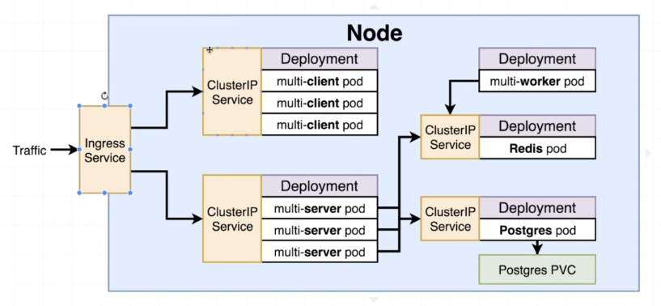

# K8s Multi Container App

## Map



- client listens on 3000
- server listens on 5000

## Steps

- create config for each service and deployment
- test locally on minikube
- create git/travis flow to build and deploy
- deploy app to cloud

## Build Using Docker

```yaml
> docker compose up --build
```

## Kubectl

- to apply all config files in a folder

```yaml
> minikube start
> kubectl apply -f k8s
```

### Cluster IP

- provides access for a set of pods to other objects inside our cluster

### PVC

- persistent volume claim
- sharing local files with a container
  - postgres stores data in a container
  - so if this container fails all data will be deleted
  - so to avoid data loss, PVC is required
- volume vs persistent volume
  - volume is inside a pod, if pod fails data is lost
  - persistent volume is out of a pod , if it fails data is not lost
- p. volume claim
  - may not be actually available
  - but can be generated
  - static - created ahead of time
  - dynamic - created when required

### Access Modes

- ReadWriteOnce
- ReadOnlyMany
- ReadWriteMany

### Storage Classes

- type of storage you wanna get
- depends on your cloud platform

- for local

```yaml
> kubectl get storageclass
```

### Secret Type

- to have a secret pass, varibale etc.
- done with an imperitive command in any env we deploy our app to
- types : tls, docker registry , generic

```yaml
> kubectl create secret generic <secret_name> --from-literal key=value

> kubectl create secret generic pgpass --from-literal PGPASSWORD=password_here

> kubectl get secrets
```

### Ingress Nginx

- url : https://github.com/kubernetes/ingress-nginx
- LoadBalacer
  - legacy way of setup access to pod
  - only used if there is 1 set of pods
  - but we have 2
- Ingress
  - more advance version
  - sends traffic directly to containers instead of config
  - can manage more than 1 pod

```yaml
> kubectl apply -f https://raw.githubusercontent.com/kubernetes/ingress-nginx/controller-v0.34.1/deploy/static/provider/cloud/deploy.yaml

> minikube addons enable ingress
```
